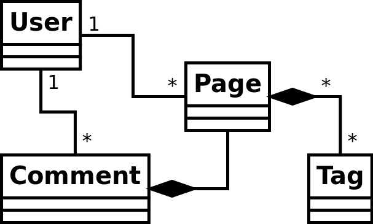

\newpage

# Järjestelmän tietosisältö

## Tietokohteet

### Sivu (Page)

Attribuutti |  Arvojoukko  | Kuvailu
------------|--------------|-------------------------------------------------
Sisältö | Merkkijono | Markdown muotoiltu merkkijono, josta sivun sisältö renderöidään html:ksi.

Käyttäjän luoma sivu, joka sisältää markdown muotoillun tekstin.
Sivulla voi olla useita aihetunnisteita. Aihetunnisteiden viitteet tuhoutuvat sivun mukana.

### Kommentti (Comment)

Attribuutti |  Arvojoukko  | Kuvailu
------------|--------------|-------------------------------------------------
Sisältö | Merkkijono | Markdown muotoiltu merkkijono, jossa kommentin sisältö.

Käyttäjän jättämä kommentti sivulla. Kommentilla voi esiintyä vain yhdellä sivulla ja olla vain yhden käyttäjän kirjoittama.
Jos käyttäjä poistetaan, ei käyttäjän jättämien kommenttien kuitenkaan pidä tuhoutua.

### Aihetunniste (Tag)

Attribuutti |  Arvojoukko  | Kuvailu
------------|--------------|-------------------------------------------------
Sisältö | Merkkijono | Aihetunnisteen sisältö.

Sivulle asetettu aihetunniste. Yhdellä sivulla voi olla useita aihetunnisteita ja yksi aihetunniste voi esiintyä usealla sivulla.
Aihetunnisteen tuhoutuessa ei siihen liitettyjen sivujen tule tuhoutua.

### Käyttäjä (User)

Attribuutti |  Arvojoukko  | Kuvailu
------------|--------------|--------
Sähköposti |  Merkkijono  | Käyttäjän tunnisteena toimiva sähköpostiosoite.
Salasana | Merkkijono | Käyttäjän salasanan hajautusarvo.

Rekisteröitynyt käyttäjä. Yhdellä käyttäjällä voi olla useita sivuja ja useita kommentteja.
Käyttäjän tuhoutuessa eivät käyttäjän luomat sivut tai kommentit tuhoudu.

