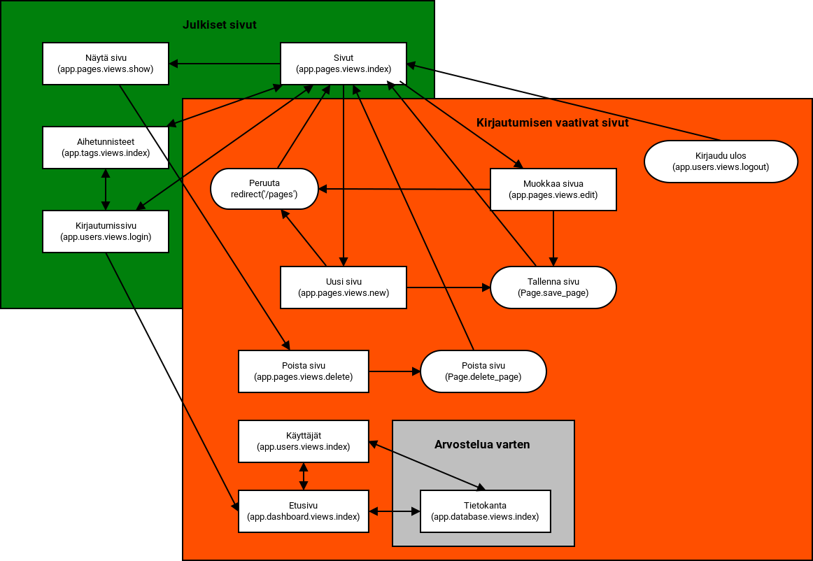

\newpage

# Käyttöliittymä ja järjestelmän komponentit

Sovelluksessa käytetään navigaatiopalkkia. 
Selkeyden vuoksi kaaviossa on jätetty piirtämättä joitakin yhteyksiä.
Navigaatiopalkista johtuen myös uloskirjautuminen on mahdollista jokaiselta sivulta kun käyttäjä on kirjautuneena.
