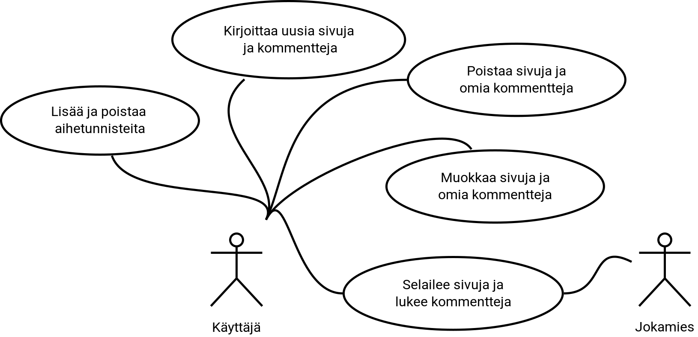

# Käyttötapaukset

Kaaviossa on edustettuna kaksi eri käyttäjää, Käyttäjä ja Jokamies.
Käyttäjään viitasessa puhutaan käyttäjästä, joka on kirjautunut sovellukseen sisään.
Jokamies -käyttäjä on kuka tahansa internettiä selaileva ja edustaa siis kirjautumatonta käyttäjää.

