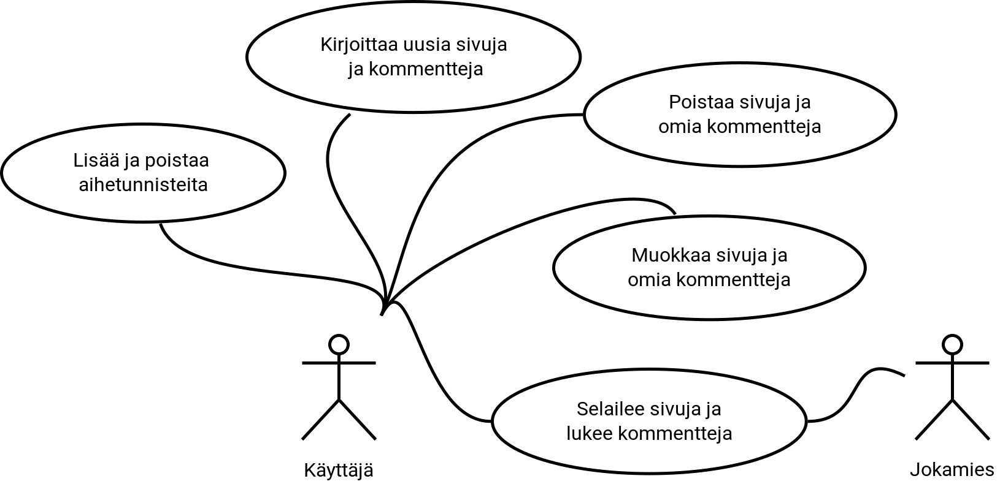

\newpage

# Yleiskuva järjestelmästä

## Käyttötapaukset

Kaaviossa on edustettuna kaksi eri käyttäjää, Käyttäjä ja Jokamies.

## Käyttäjäryhmät

### Jokamies
Jokamies -käyttäjä on kuka tahansa internettiä selaileva ja edustaa kirjautumatonta käyttäjää.
Kirjautumaton käyttäjä voi ainoastaan lukea sivuja sekä kommentteja.

### Käyttäjä
Käyttäjää on kuka tahansa, joka on kirjautunut sovellukseen sisään.
Kirjautumiseen käyttäjä tarvitsee sähköpostiosoitteen ja salasanan.
Kirjautunut käyttäjä voi luoda, lukea, muokata ja poistaa sivuja, kommentteja sekä aihetunnisteita.

## Käyttötapauskuvaukset

#### Selailee sivuja ja lukee kommentteja
Kuka tahansa julkista internetiä käyttävä pääsee selailemaan sivuja ja kommentteja.

#### Kirjoittaa uusia sivuja ja kommentteja
Kirjautuneena käyttäjä voi luoda uusia sivuja ja kommentteja.

#### Muokkaa sivuja ja omia kommentteja
Kirjautunut käyttäjä voi muokata sivuja sekä omia kommenttejaan.
Käyttäjä ei saa muokata toisten käyttäjien jättämiä kommentteja.

#### Lisää ja poistaa aihetunnisteita
Kirjautuneena käyttäjä voi lisätä ja poistaa aihetunnisteita.

#### Muut käyttötapaukset
Muita käyttötapauksia ovat mm. kirjautuminen ja rekisteröityminen.